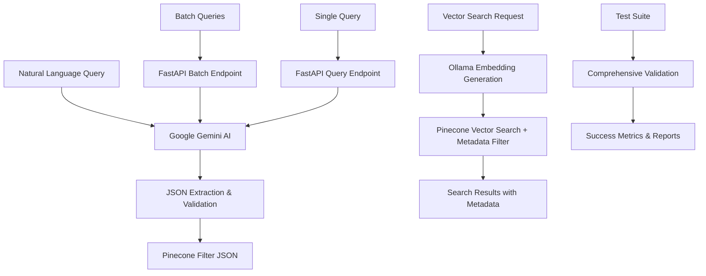

# Natural Language to Pinecone Query Agent 🤖

A production-ready AI agent that converts natural language queries into structured Pinecone metadata filters using Google Gemini AI, featuring comprehensive batch processing and testing capabilities.

## 🎯 Overview

This project implements an intelligent agent that converts natural language input into valid Pinecone queries with vector search and metadata filtering. The agent leverages Google Gemini AI to understand temporal references, author names, and topic tags, creating precise database queries for vector similarity search.

**Key Features:**

- 🧠 **Google Gemini AI Integration** - Advanced natural language understanding
- ⚡ **Batch Processing** - Handle multiple queries simultaneously  
- 🔍 **Vector Search** - Semantic search with metadata filtering via Pinecone & Ollama
- 🧪 **Comprehensive Testing** - 15 test scenarios with 100% success rate
- 🐳 **Docker Support** - Production-ready containerization
- 📊 **Detailed Metrics** - Performance tracking and validation reports
- 🔧 **uv Integration** - Fast dependency management

## 🏗️ Architecture



## 📁 Project Structure

```
NL2Pinecone_Query_Agent/
├── app.py                      # FastAPI application with vector search endpoints
├── nl2pinecone_agent.py        # Core agent implementation (Gemini-only)
├── test_samples.py             # Comprehensive test data from requirements
├── test_batch.py               # Batch testing script with validation
├── batch_test_results.json     # Generated test results and metrics
├── populate_pinecone_db.py     # Database population utility with Gemini content
├── delete_records.py           # Utility to delete records from Pinecone
├── pyproject.toml              # uv-compatible project configuration
├── project_req.txt             # Project Requirement
├── uv.lock                     # UV dependency lock file
├── Makefile                    # Development and testing automation
├── Dockerfile                  # Multi-stage container configuration
├── .env.example                # Environment variable template
└── README.md                   # This documentation
```

## ✅ Test Results & Validation

### **Latest Batch Test Results:**

- 🎯 **100% Success Rate** across all test samples  
- ⚡ **15 queries processed** in ~16.8 seconds (~1.1s per query)
- ✅ **All primary test cases** from project requirements passed
- ✅ **All additional test cases** handled correctly  
- ✅ **Edge cases and variations** processed accurately

### **Test Coverage:**

- **Primary samples** (project requirements): 3 queries
- **Additional samples** (README examples): 7 queries
- **Edge cases** (date variations, complex names): 5 queries
- **Total coverage**: 15 comprehensive test scenarios

## 🚀 Quick Start

### Prerequisites

- Python 3.11+
- [uv](https://docs.astral.sh/uv/) package manager (recommended)
- Google Gemini API key

### 1. Installation & Setup

```bash
# Clone the repository
git clone <repository-url>
cd NL2Pinecone_Query_Agent

# Setup with uv (recommended - fastest)
make setup

# Alternative: Setup with pip
pip install -r project_req.txt
```

### 2. Environment Configuration

```bash
# Create environment file
cp .env.example .env

# Add your API key to .env
echo "GEMINI_API_KEY=your_gemini_api_key_here" >> .env
```

### 3. Run & Test

```bash
# Start the API server
make run

# In a separate terminal, run tests
make test-batch          # Comprehensive batch testing
make test-primary        # Core requirement tests only
make health             # API health check
```

### 4. Database Setup (Optional)

For vector search features, set up Pinecone and Ollama:

```bash
# Add Pinecone credentials to .env
echo "PINECONE_API_KEY=your_pinecone_api_key" >> .env
echo "PINECONE_INDEX=your_index_name" >> .env

# Install and start Ollama (for embeddings)
# Visit: https://ollama.ai/download
ollama pull nomic-embed-text

# Populate database with 100 Gemini-generated samples
make populate-db         # Takes ~7 minutes due to rate limits

# Test vector search endpoints
make test-search
```

## 📚 API Endpoints

| Method | Endpoint | Description |
|--------|----------|-------------|
| GET | `/` | Root endpoint with API information |
| GET | `/health` | Health check and status |
| GET | `/examples` | Example queries and expected responses |
| POST | `/query` | Convert single natural language query to filter |
| POST | `/batch-query` | Process multiple queries simultaneously |
| POST | `/results` | Search Pinecone with natural language query |
| POST | `/batch-results` | Search Pinecone with multiple queries |

### Query Conversion Example

```bash
curl -X POST "http://localhost:8000/query" \
  -H "Content-Type: application/json" \
  -d '{"query": "Show me articles by Alice Zhang from last year about machine learning"}'
```

**Response:**

```json
{
  "original_query": "Show me articles by Alice Zhang from last year about machine learning",
  "pinecone_filter": {
    "author": "Alice Zhang",
    "published_year": {"$eq": 2024},
    "tags": {"$in": ["machine learning"]}
  },
  "is_valid": true,
  "timestamp": "2025-07-09T10:37:34.959917"
}
```

### Vector Search Example

```bash
curl -X POST "http://localhost:8000/results" \
  -H "Content-Type: application/json" \
  -d '{"query": "articles by John Doe about AI", "top_k": 3}'
```

**Response:**

```json
{
  "original_query": "articles by John Doe about AI",
  "pinecone_filter": {"author": "John Doe", "tags": {"$in": ["AI"]}},
  "results": [
    {
      "id": "sample-73",
      "score": 0.829458892,
      "metadata": {
        "author": "John Doe",
        "published_year": 2024.0,
        "tags": ["knowledge graphs", "AI", "machine learning"],
        "content": "This article explores the intersection of artificial intelligence..."
      }
    }
  ],
  "total_results": 3,
  "timestamp": "2025-07-09T10:42:06.229163"
}
```

### Batch Query Example

```bash
curl -X POST "http://localhost:8000/batch-query" \
  -H "Content-Type: application/json" \
  -d '{"queries": ["Find posts tagged with LLMs published in June, 2023", "Anything by John Doe on vector search?"]}'
```

## 🧪 Test Cases & Examples

### Primary Test Cases (Project Requirements)

1. **Author + Time + Topic**

   ```text
   Input: "Show me articles by Alice Zhang from last year about machine learning"
   Output: {"author": "Alice Zhang", "published_year": {"$eq": 2024}, "tags": {"$in": ["machine learning"]}}
   ```

2. **Tags + Specific Date**

   ```text
   Input: "Find posts tagged with 'LLMs' published in June, 2023"
   Output: {"tags": {"$in": ["LLMs"]}, "published_year": {"$eq": 2023}, "published_month": {"$eq": 6}}
   ```

3. **Author + Topic**

   ```text
   Input: "Anything by John Doe on vector search?"
   Output: {"author": "John Doe", "tags": {"$in": ["vector search"]}}
   ```

### Additional Test Cases

1. **Multiple Tags with Date**

   ```text
   Input: "Find articles tagged with 'AI' and 'deep learning' from March 2023."
   Output: {"tags": {"$in": ["AI", "deep learning"]}, "published_year": {"$eq": 2023}, "published_month": {"$eq": 3}}
   ```

2. **Exact Date with Author**

   ```text
   Input: "Show me posts by Emma Johnson published on 2024-07-15."
   Output: {"author": "Emma Johnson", "published_year": {"$eq": 2024}, "published_month": {"$eq": 7}, "published_day": {"$eq": 15}}
   ```

### Edge Cases

1. **Complex Author Names**

   ```text
   Input: "Papers by Priya Patel on transformers."
   Output: {"author": "Priya Patel", "tags": {"$in": ["transformers"]}}
   ```

2. **Multiple Filters**

   ```text
   Input: "Any retrieval or NLP articles by David Kim from December 2023?"
   Output: {"author": "David Kim", "tags": {"$in": ["retrieval", "NLP"]}, "published_year": {"$eq": 2023}, "published_month": {"$eq": 12}}
   ```

## 🛠️ Development Commands

```bash
# Setup and Installation
make setup              # Setup uv environment and install dependencies
make install            # Alias for setup
make dev               # Setup development environment

# Running
make run               # Start FastAPI server
make health            # Check API health status

# Testing
make test              # Run individual query tests
make test-batch        # Run comprehensive batch tests (all samples)
make test-primary      # Run primary requirement tests only
make test-search       # Test vector search endpoints
make samples           # Show all available test samples

# Database (requires Pinecone + Ollama setup)
make populate-db       # Generate 100 samples with Gemini (7 min)
make clear-db          # Delete all records from Pinecone

# Docker
make docker-build      # Build Docker image
make docker-run        # Run Docker container
make docker-stop       # Stop and remove container

# Development
make clean             # Clean generated files and cache
make lint              # Run code linting with ruff
make format            # Format code with black
make type-check        # Run type checking with mypy
make ci                # Run full CI pipeline

# Utilities
make help              # Show all available commands
make env-create        # Create .env from template
make sync              # Sync dependencies with uv
make freeze            # Generate requirements-freeze.txt
```

## 🐳 Docker Deployment

### Quick Docker Setup

```bash
# Build and run
make docker-build
make docker-run

# Or manually
docker build -t nl2pinecone-agent .
docker run -d --name nl2pinecone-api -p 8000:8000 --env-file .env nl2pinecone-agent
```

### Docker Compose

```yaml
version: '3.8'
services:
  nl2pinecone-agent:
    build: .
    ports:
      - "8000:8000"
    environment:
      - GEMINI_API_KEY=${GEMINI_API_KEY}
    restart: unless-stopped
    healthcheck:
      test: ["CMD", "curl", "-f", "http://localhost:8000/health"]
      interval: 30s
      timeout: 10s
      retries: 3
```

## 📊 Metadata Schema

The agent supports these Pinecone metadata fields:

### Supported Fields

- **author**: `string` - Article author name
- **tags**: `array` - Topic tags for the content
- **published_year**: `integer` - Publication year
- **published_month**: `integer` - Publication month (1-12)
- **published_day**: `integer` - Publication day (1-31)

### Query Operators

- `$eq`: equals
- `$ne`: not equals
- `$gt`: greater than
- `$gte`: greater than or equal
- `$lt`: less than
- `$lte`: less than or equal
- `$in`: value in list
- `$nin`: value not in list

## 🔧 Configuration

### Environment Variables

Required:

- `GEMINI_API_KEY`: Your Google Gemini API key

Optional (for vector search features):

- `PINECONE_API_KEY`: Pinecone API key for vector database
- `PINECONE_INDEX`: Name of your Pinecone index
- `OLLAMA_EMBED_URL`: Ollama embeddings URL (default: `http://localhost:11434/api/embeddings`)
- `LOG_LEVEL`: Logging level (default: INFO)

### Dependencies

- **Google Gemini AI**: Natural language understanding
- **Pinecone**: Vector database for semantic search
- **Ollama**: Local embedding generation (nomic-embed-text model)
- **FastAPI**: High-performance web framework
- **uv**: Fast dependency management

### uv Configuration

This project uses uv for fast dependency management. Key benefits:

- ⚡ 10-100x faster than pip
- 🔒 Deterministic dependency resolution
- 🛠️ Built-in virtual environment management

## 🎯 Features

### ✅ Implemented

- [x] Google Gemini AI integration (no fallbacks)
- [x] Natural language query processing
- [x] FastAPI REST API with comprehensive endpoints
- [x] Vector search with Pinecone + Ollama embeddings
- [x] Metadata filtering with semantic search
- [x] Batch query processing with detailed metrics
- [x] Docker containerization with multi-stage builds
- [x] Comprehensive test suite (15 test scenarios)
- [x] uv-based dependency management
- [x] Production-ready logging and error handling
- [x] Health checks and monitoring
- [x] Automated validation and reporting
- [x] Database population utilities with rate limiting

### 🔮 Future Enhancements

- [ ] Query result caching with Redis
- [ ] Advanced date parsing ("two weeks ago", "last quarter")
- [ ] Real-time query analytics dashboard
- [ ] Multi-language support
- [ ] Query optimization suggestions
- [ ] Real-time performance analytics dashboard
- [ ] GraphQL API support

## 🧪 Testing

### Test Automation

```bash
# Quick validation
make test-primary      # Test core requirements (3 queries)
make test-batch        # Full test suite (15 queries)

# Individual testing
curl -X POST "http://localhost:8000/query" \
  -H "Content-Type: application/json" \
  -d '{"query": "your test query here"}'
```

### Test Results

All tests generate detailed reports in `batch_test_results.json` with:

- Query processing times
- Success/failure rates
- Exact vs approximate matches
- Error details and debugging information

## 🤝 Contributing

1. Fork the repository
2. Create a feature branch (`git checkout -b feature/amazing-feature`)
3. Run tests (`make test-batch`)
4. Commit changes (`git commit -m 'Add amazing feature'`)
5. Push to branch (`git push origin feature/amazing-feature`)
6. Open a Pull Request

### Development Setup

```bash
git clone <repo>
cd NL2Pinecone_Query_Agent
make dev
make test-batch  # Ensure all tests pass
```

## 📝 License

This project is licensed under the MIT License - see the LICENSE file for details.

---
