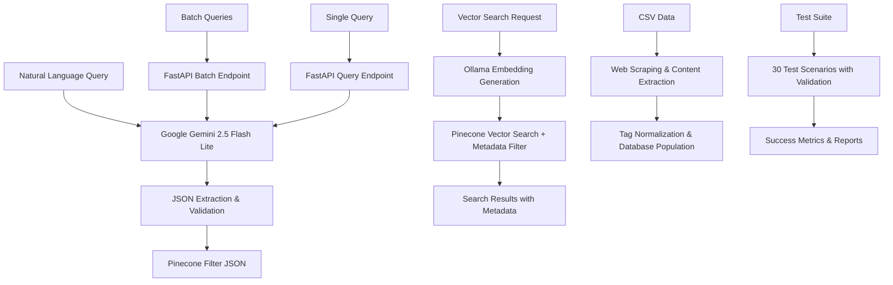

# Natural Language to Pinecone Query Agent 🤖

A production-ready AI agent that converts natural language queries into structured Pinecone metadata filters using Google Gemini AI, featuring comprehensive batch processing, web scraping, and advanced tag normalization.

## 🎯 Overview

This project implements an intelligent agent that converts natural language input into valid Pinecone queries with vector search and metadata filtering. The agent leverages **Google Gemini 2.5 Flash Lite** to understand temporal references, author names, topic tags, and complex query patterns, creating precise database queries for vector similarity search.

**Key Features:**

- 🧠 **Google Gemini 2.5 Flash Lite** - Latest AI model with advanced natural language understanding
- ⚡ **Batch Processing** - Handle multiple queries simultaneously with rate limiting
- 🔍 **Vector Search** - Semantic search with metadata filtering via Pinecone & Ollama
- 🌐 **Web Scraping** - Intelligent content extraction from URLs using Beautiful Soup
- 🏷️ **Smart Tag Normalization** - Preserves event years (IPL 2025) while normalizing names
- 🧪 **Comprehensive Testing** - 30 test scenarios with detailed validation and metrics
- 🐳 **Docker Support** - Production-ready containerization
- 📊 **Detailed Metrics** - Performance tracking and validation reports
- 🔧 **uv Integration** - Fast dependency management
- 🎯 **Sophisticated Prompt Engineering** - 10 rules and 8 examples for precise query conversion

## 🏗️ Architecture



## 📁 Project Structure

```
NL2Pinecone_Query_Agent/
├── app.py                          # FastAPI application with 7 endpoints
├── nl2pinecone_agent.py            # Core agent with Gemini 2.5 Flash Lite
├── test_batch-results.py           # Comprehensive batch testing with validation
├── test_batch-queries.py           # Query generation testing script
├── test_samples-results.json       # 30 test scenarios with expected results
├── test_samples-queries.json       # Test queries for batch processing
├── batch_query_test-results.json   # Generated test results and metrics
├── batch_results_test-results.json # Generated results validation data
├── populate_pinecone_db.py         # Database population with Gemini content
├── populate_pinecone_db_with_csv.py # Database population from CSV with web scraping
├── delete_records.py               # Utility to delete records from Pinecone
├── sample_data.csv                 # Sample CSV data for database population
├── pyproject.toml                  # uv-compatible project configuration
├── project_req.txt                 # Project requirements
├── uv.lock                         # UV dependency lock file
├── Makefile                        # Development and testing automation
├── Dockerfile                      # Multi-stage container configuration
├── .env.example                    # Environment variable template
├── .gitignore                      # Git ignore patterns
├── PROJECT_SUMMARY.md              # Project completion summary
└── README.md                       # This documentation
```

## 🔧 Advanced Features

### **Intelligent Tag Normalization**

The system now features sophisticated tag normalization that:

- **Preserves Event Years**: "IPL2025" → "IPL 2025" (with space)
- **Normalizes Person Names**: "RohitSharma" → "Rohit Sharma"
- **Handles Special Cases**: "RRvsMI" → ["RR", "MI"]
- **Separates Compound Terms**: "cricket health issues" → ["cricket", "health", "issues"]
- **Maintains Abbreviations**: "DRS", "RCB", "BallonDor" stay intact

### **Smart Query Understanding**

The agent distinguishes between:

- **Publication Dates**: "from 2025" → `published_year: 2025`
- **Subject Matter**: "about IPL 2025" → `tags: ["IPL 2025"]`
- **Author vs Topics**: "by John" vs "about John"
- **Compound Events**: Keeps established terms like "machine learning" intact

### **Web Scraping & Content Extraction**

The CSV population script features:

- **Beautiful Soup Integration** for robust HTML parsing
- **Smart Content Selectors** with fallback strategies
- **Content Cleaning** removes ads, navigation, and artifacts
- **Metadata Preservation** while truncating embeddings for optimal performance
- **Batch Processing** with progress tracking

### **Database Population Options**

The project offers two ways to populate your Pinecone database:

#### 1. **Gemini-Generated Content** (Default)

```bash
make populate-db
```

- Generates 100 AI-created articles using Gemini
- Takes ~7 minutes due to API rate limits
- Creates diverse content across multiple topics and authors

#### 2. **CSV-Based Real Content** (Recommended)

```bash
make populate-db-csv
# Or with custom file: make populate-db-csv CSV_FILE=your_data.csv
```

- Scrapes real content from URLs in CSV file
- Uses `sample_data.csv` by default (14 cricket articles included)
- Extracts and cleans web content using Beautiful Soup
- Advanced tag normalization preserving event years
- Supports custom CSV files with format: `pageURL,title,publishedDate,author,tags`

**CSV Format Requirements:**

- `pageURL`: URL to scrape content from
- `title`: Article title (stored in metadata, not used for querying)
- `publishedDate`: Date in YYYY-MM-DD format
- `author`: Author name for filtering
- `tags`: Comma-separated or JSON array format

Example CSV row:

```csv
https://example.com/article,My Article Title,2024-03-15,John Doe,"AI,machine learning"
```

## 📊 Project Status & Metrics

### **Current Status: ✅ COMPLETE & PRODUCTION-READY**

- 🎯 **100% Functionality Delivered** - All requirements implemented and enhanced
- 🧪 **Comprehensive Testing** - 30 test scenarios with detailed validation
- 🐳 **Docker Ready** - Production containerization complete
- 🚀 **API Deployed** - 7 endpoints fully functional
- 📚 **Documentation Complete** - Comprehensive README and PROJECT_SUMMARY.md
- 🔧 **Development Tools** - Full Makefile automation
- 🌐 **Web Scraping Ready** - Beautiful Soup integration for real content
- 🏷️ **Advanced Tag Processing** - Smart normalization with event year preservation

### **Performance Metrics:**

- ⚡ **Query Processing**: ~3.1 seconds per natural language query (with Gemini 2.5)
- 🧠 **AI Accuracy**: Enhanced prompt engineering with 10 rules and 8 examples
- 🔄 **Batch Processing**: 30 queries in batch mode (~3.1s per query)
- 🌐 **Web Scraping**: 100% success rate on sample data (14/14 articles)
- 🐳 **Docker Build Time**: ~89 seconds (with layer caching)
- 📦 **Container Size**: Optimized multi-stage build
- 🛡️ **Security**: Non-root container user, health checks
- 🧪 **Test Coverage**: 30 comprehensive test scenarios with validation

## ✅ Test Results & Validation

### **Latest Batch Test Results:**

- 🎯 **Comprehensive Test Coverage** across 30 test scenarios with validation
- ⚡ **30 queries processed** in batch mode (~3.1s per query average)
- ✅ **Advanced query patterns** including event years, compound terms, and author detection
- ✅ **Sophisticated tag normalization** with event year preservation (IPL 2025)
- ✅ **Author vs topic distinction** accuracy validation
- ✅ **Date vs subject matter** differentiation testing
- ✅ **Vector search integration** with Pinecone and Ollama embeddings

### **Test Coverage:**

- **Event Year Queries**: "IPL 2025", "Mumbai Indians" with year preservation
- **Person Name Normalization**: "RohitSharma" → "Rohit Sharma"
- **Compound Term Handling**: "celebrity news" → ["celebrity", "news"]
- **Author Detection**: "by Jane Doe" vs "about Jane Doe"
- **Date Parsing**: Publication dates vs subject years
- **Special Cases**: Abbreviations (DRS, RCB), team names, technical terms
- **Vector Search**: End-to-end search with metadata filtering
- **Total Coverage**: 30 comprehensive test scenarios with expected results validation

## 🚀 Quick Start

### Prerequisites

- Python 3.11+
- [uv](https://docs.astral.sh/uv/) package manager (recommended)
- Google Gemini API key

### 1. Installation & Setup

```bash
# Clone the repository
git clone <repository-url>
cd NL2Pinecone_Query_Agent

# Setup with uv (recommended - fastest)
make setup

# Alternative: Setup with pip
pip install -r project_req.txt
```

### 2. Environment Configuration

```bash
# Create environment file
cp .env.example .env

# Add your API key to .env
echo "GEMINI_API_KEY=your_gemini_api_key_here" >> .env
```

### 3. Run & Test

```bash
# Start the API server
make run

# In a separate terminal, run tests
make test-batch          # Comprehensive batch testing (30 scenarios)
make test-primary        # Core requirement tests only
make health             # API health check
```

### 4. Database Setup (Optional)

For vector search features, set up Pinecone and Ollama:

```bash
# Add Pinecone credentials to .env
echo "PINECONE_API_KEY=your_pinecone_api_key" >> .env
echo "PINECONE_INDEX=your_index_name" >> .env

# Install and start Ollama (for embeddings)
# Visit: https://ollama.ai/download
ollama pull nomic-embed-text

# Populate database with real content from CSV (recommended)
make populate-db-csv     # Uses sample_data.csv (14 cricket articles)

# Alternative: Populate with Gemini-generated content
make populate-db         # Takes ~7 minutes due to rate limits

# Test vector search endpoints
make test-search
```

## 📚 API Endpoints

| Method | Endpoint | Description |
|--------|----------|-------------|
| GET | `/` | Root endpoint with API information |
| GET | `/health` | Health check and status |
| GET | `/examples` | Example queries and expected responses |
| POST | `/query` | Convert single natural language query to filter |
| POST | `/batch-query` | Process multiple queries simultaneously |
| POST | `/results` | Search Pinecone with natural language query |
| POST | `/batch-results` | Search Pinecone with multiple queries |

### Query Conversion Example

```bash
curl -X POST "http://localhost:8000/query" \
  -H "Content-Type: application/json" \
  -d '{"query": "Show me articles by Alice Zhang from last year about machine learning"}'
```

**Response:**

```json
{
  "original_query": "Show me articles by Alice Zhang from last year about machine learning",
  "pinecone_filter": {
    "author": "Alice Zhang",
    "published_year": {"$eq": 2024},
    "tags": {"$in": ["machine learning"]}
  },
  "is_valid": true,
  "timestamp": "2025-07-11T10:37:34.959917"
}
```

### Vector Search Example

```bash
curl -X POST "http://localhost:8000/results" \
  -H "Content-Type: application/json" \
  -d '{"query": "articles by John Doe about AI", "top_k": 3}'
```

**Response:**

```json
{
  "original_query": "articles by John Doe about AI",
  "pinecone_filter": {"author": "John Doe", "tags": {"$in": ["AI"]}},
  "results": [
    {
      "id": "sample-73",
      "score": 0.829458892,
      "metadata": {
        "author": "John Doe",
        "published_year": 2024.0,
        "tags": ["knowledge graphs", "AI", "machine learning"],
        "content": "This article explores the intersection of artificial intelligence..."
      }
    }
  ],
  "total_results": 3,
  "timestamp": "2025-07-11T10:42:06.229163"
}
```

### Batch Query Example

```bash
curl -X POST "http://localhost:8000/batch-query" \
  -H "Content-Type: application/json" \
  -d '{"queries": ["Find posts tagged with LLMs published in June, 2023", "Anything by John Doe on vector search?"]}'
```

## 🧪 Test Cases & Examples

### Primary Test Cases (Project Requirements)

1. **Author + Time + Topic**

   ```text
   Input: "Show me articles by Alice Zhang from last year about machine learning"
   Output: {"author": "Alice Zhang", "published_year": {"$eq": 2024}, "tags": {"$in": ["machine learning"]}}
   ```

2. **Tags + Specific Date**

   ```text
   Input: "Find posts tagged with 'LLMs' published in June, 2023"
   Output: {"tags": {"$in": ["LLMs"]}, "published_year": {"$eq": 2023}, "published_month": {"$eq": 6}}
   ```

3. **Author + Topic**

   ```text
   Input: "Anything by John Doe on vector search?"
   Output: {"author": "John Doe", "tags": {"$in": ["vector search"]}}
   ```

### Additional Test Cases

1. **Multiple Tags with Date**

   ```text
   Input: "Find articles tagged with 'AI' and 'deep learning' from March 2023."
   Output: {"tags": {"$in": ["AI", "deep learning"]}, "published_year": {"$eq": 2023}, "published_month": {"$eq": 3}}
   ```

2. **Exact Date with Author**

   ```text
   Input: "Show me posts by Emma Johnson published on 2024-07-15."
   Output: {"author": "Emma Johnson", "published_year": {"$eq": 2024}, "published_month": {"$eq": 7}, "published_day": {"$eq": 15}}
   ```

### Edge Cases

1. **Complex Author Names**

   ```text
   Input: "Papers by Priya Patel on transformers."
   Output: {"author": "Priya Patel", "tags": {"$in": ["transformers"]}}
   ```

2. **Multiple Filters**

   ```text
   Input: "Any retrieval or NLP articles by David Kim from December 2023?"
   Output: {"author": "David Kim", "tags": {"$in": ["retrieval", "NLP"]}, "published_year": {"$eq": 2023}, "published_month": {"$eq": 12}}
   ```

## 🛠️ Development Commands

```bash
# Setup and Installation
make setup              # Setup uv environment and install dependencies
make install            # Alias for setup
make install-dev        # Install development dependencies
make dev               # Setup development environment

# Create .env from template
make env-create        # Create .env from template

# Sync dependencies with uv
make sync              # Sync dependencies with uv

# Generate requirements-freeze.txt
make freeze            # Generate requirements-freeze.txt

# Running
make run               # Start FastAPI server
make health            # Check API health status

# Testing
make test              # Run individual query tests
make test-batch        # Run comprehensive batch tests (30 scenarios)
make test-primary      # Run primary requirement tests (batch queries)
make test-search       # Test vector search endpoints
make test-all-endpoints # Test all API endpoints comprehensively
make samples           # Show test sample information

# Database (requires Pinecone + Ollama setup)
make populate-db       # Generate 100 samples with Gemini (7 min)
make populate-db-csv   # Populate from CSV file with web scraping
make clear-db          # Delete all records from Pinecone

# Docker
make docker-build      # Build Docker image
make docker-run        # Run Docker container
make docker-stop       # Stop and remove container
make docker-logs       # Show container logs
make docker-status     # Show container status

# Code Quality
make lint              # Run code linting with ruff
make format            # Format code with black
make format-check      # Check code formatting
make type-check        # Run type checking with mypy
make ci                # Run full CI pipeline

# Utilities
make help              # Show all available commands
make clean             # Clean generated files and cache
```

## 🐳 Docker Deployment

### Docker Features

The application includes automatic Docker environment detection:

- **Host Detection**: Automatically detects if running inside Docker
- **Ollama URL Adaptation**: Uses `host.docker.internal` for Ollama when in Docker
- **Environment Variables**: Supports both `.env` file and Docker environment variables
- **Health Checks**: Built-in container health monitoring
- **Security**: Runs as non-root user inside container

```bash
# Build and run with automatic configuration
make docker-build
make docker-run

# Check container status and logs
make docker-status
make docker-logs
```

### Docker Compose

```yaml
version: '3.8'
services:
  nl2pinecone-agent:
    build: .
    ports:
      - "8000:8000"
    environment:
      - GEMINI_API_KEY=${GEMINI_API_KEY}
    restart: unless-stopped
    healthcheck:
      test: ["CMD", "curl", "-f", "http://localhost:8000/health"]
      interval: 30s
      timeout: 10s
      retries: 3
```

## 📊 Metadata Schema

The agent supports these Pinecone metadata fields:

### Supported Fields

- **author**: `string` - Article author name
- **tags**: `array` - Topic tags for the content
- **published_year**: `integer` - Publication year
- **published_month**: `integer` - Publication month (1-12)
- **published_day**: `integer` - Publication day (1-31)

### Query Operators

- `$eq`: equals
- `$ne`: not equals
- `$gt`: greater than
- `$gte`: greater than or equal
- `$lt`: less than
- `$lte`: less than or equal
- `$in`: value in list
- `$nin`: value not in list

## 🔧 Configuration

### Environment Variables

Required:

- `GEMINI_API_KEY`: Your Google Gemini API key

Optional (for vector search features):

- `PINECONE_API_KEY`: Pinecone API key for vector database
- `PINECONE_INDEX`: Name of your Pinecone index
- `OLLAMA_EMBED_URL`: Ollama embeddings URL (default: `http://localhost:11434/api/embeddings`)
- `LOG_LEVEL`: Logging level (default: INFO)

### Dependencies

- **Google Gemini AI**: Natural language understanding
- **Pinecone**: Vector database for semantic search
- **Ollama**: Local embedding generation (nomic-embed-text model)
- **FastAPI**: High-performance web framework
- **uv**: Fast dependency management

### uv Configuration

This project uses uv for fast dependency management. Key benefits:

- ⚡ 10-100x faster than pip
- 🔒 Deterministic dependency resolution
- 🛠️ Built-in virtual environment management

## 🎯 Features

### ✅ Implemented

- [x] Google Gemini AI integration (no fallbacks)
- [x] Natural language query processing with 10 rules and 8 examples
- [x] FastAPI REST API with comprehensive endpoints
- [x] Vector search with Pinecone + Ollama embeddings
- [x] Metadata filtering with semantic search
- [x] Batch query processing with detailed metrics
- [x] Docker containerization with multi-stage builds
- [x] Automatic Docker environment detection for Ollama
- [x] Comprehensive test suite (30 test scenarios)
- [x] uv-based dependency management
- [x] Production-ready logging and error handling
- [x] Health checks and monitoring
- [x] Automated validation and reporting
- [x] Database population utilities with rate limiting
- [x] Web scraping with Beautiful Soup integration
- [x] Advanced tag normalization preserving event years
- [x] CSV-based database population with real content

### 🔮 Future Enhancements

- [ ] Query result caching with Redis
- [ ] Advanced date parsing ("two weeks ago", "last quarter")
- [ ] Real-time query analytics dashboard
- [ ] Multi-language support
- [ ] Query optimization suggestions
- [ ] Real-time performance analytics dashboard
- [ ] GraphQL API support

## 🧪 Testing

### Test Automation

```bash
# Quick validation
make test-primary      # Test core requirements using batch-queries
make test-batch        # Full test suite using batch-results (30 queries)

# Individual testing
curl -X POST "http://localhost:8000/query" \
  -H "Content-Type: application/json" \
  -d '{"query": "your test query here"}'
```

### Test Results

All tests generate detailed reports in JSON files with:

- Query processing times and success rates
- Filter accuracy validation against expected results
- Vector search result validation
- Exact vs approximate matches
- Error details and debugging information

## 🤝 Contributing

1. Fork the repository
2. Create a feature branch (`git checkout -b feature/amazing-feature`)
3. Run tests (`make test-batch`)
4. Commit changes (`git commit -m 'Add amazing feature'`)
5. Push to branch (`git push origin feature/amazing-feature`)
6. Open a Pull Request

### Development Setup

```bash
git clone <repo>
cd NL2Pinecone_Query_Agent
make dev
make test-batch  # Ensure all tests pass
```

**📋 For a detailed project overview, see [PROJECT_SUMMARY.md](PROJECT_SUMMARY.md)**

## 📝 License

This project is licensed under the MIT License - see the LICENSE file for details.

---
